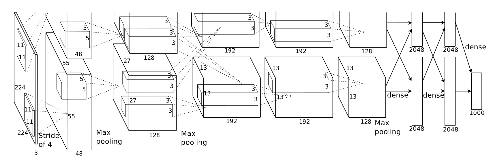

# AlexNet论文笔记

## Local Response Normalization

作用：增加泛化能力

顺序：在训练前随机确定

超参数：$k=2,n=5,\alpha=10^{-4}, \beta=0.75$

应用：ReLU激活之后

## 网络结构

- 这里的部分卷积层似乎省略了一些步骤，卷积图的大小并不是由一般的卷积公式计算得出。
- 2，4，5层的卷积核只跟位于同一边GPU的卷积层连接。
- 先进行normalization、max pooling，再卷积操作。

