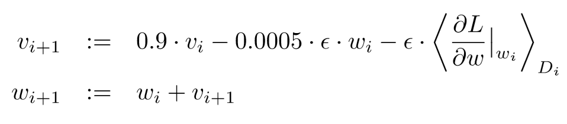

# AlexNet论文笔记

## 数据集

ILSVRC：是ImageNet的一部分

- 训练集：1.2million
- 验证集：50,000
- 测试集：150,000
- 图像预处理：
  - 大小：下采样至 $256\times 256$
  - RGB：centered

关于error-rate

- top-1
- top-5：正确标签不在预测结果的前五的比例

## 网络结构

为什么用CNN：

- 更强的学习能力，而且可以通过改变深度和卷积核大小来控制
- 符合视觉特征
- 与相同层数的普通神经网络相比，参数更少，更容易训练，效果在理论上只差一点。

网络一共有8层，5层卷积，3层全连接。

- 这里的部分卷积层似乎省略了一些步骤，卷积图的大小并不是由一般的卷积公式计算得出。
- 2，4，5层的卷积核只跟位于同一边GPU的上层卷积层连接。
- Local Response Normalization在conv1和conv2之后。
- max pooling: normalization之后和conv5之后
- dropout：fc1, fc2

特点：

1. ReLU激活函数：非饱和，解决梯度消失问题，加快训练速度
2. 多GPU训练：局限于当时的GPU显存问题，作者采用多GPU训练的方案
   - 每个GPU放一半的Kernels/Neurons
   - GPU只在特定层交流（具体哪一层由cross-validation决定）
3. Local Response Normalization：提高泛化能力
   - 在训练之前决定好map的顺序（随机）
   - 超参数：$k=2,n=5,\alpha=10^{-4}, \beta=0.75$
4. overlapping pooling：不容易过拟合
   - step = 2, size = 3

## 防止过拟合

防止过拟合的两个措施：数据增强，dropout

### 数据增强

对数据集进行 label-preserving transformations

1. image translations and horizontal reflection：

   - 训练时：在原始图片中随机截取一部分及其水平翻转作为输入
   - 测试时：取四个角落和中心的patches，及其水平翻转，共10张图片做预测，然后对10个softmax层输出结果进行平均
   - 有个缺点：降低了样本的独立性

2. 改变训练集的RGB通道数值。
   $$
   I_{xy} = [I_{xy}^R, I_{xy}^G, I_{xy}^B]^T \\
   [p_1,p_2, p_3]\cdot[\alpha_1 \lambda_1, \alpha_2\lambda_2,\alpha_3\lambda_3]^T
   $$

   - $p_i, \lambda_i$：RGB协方差矩阵的特征向量和特征值
   - $\alpha_i \sim N(0,0.1^2)$ 同一幅图用一组 $\alpha_i$

### Dropout

训练时：以0.5概率把隐藏层神经元的输出置零。

测试时：不置零，但把神经元的输出结果乘以0.5

特点：模拟多个神经网络结构输出。因为每次dropout的神经元不同，所以每次给定input时，神经网络的结构都是有差别的。

## 训练细节

参数：

- batch size: 128
- momentum: 0.9
- weight decay: 0.0005（好处：正则化，减小训练误差）
- initial weights: $\sim N(0, 0.01^2)$
- bias: 
  - 1 (conv: 2,4,5; fc)
  - 0 (other)
- learning rate：初始0.01，当验证误差没有提升的时候乘以0.1

更新公式：

## 其他

关于比较两幅图像的特征的相似度：论文提出利用最后一层隐藏层的输出向量的欧式距离来比较。原始图像的L2范数往往差别很大，因为存在位置不同、水平翻转的问题。

关于计算维数很大两个的向量的欧式距离：训练auto-encoder，把向量压缩成二进制码。

## 问题

1. 网络结构图片是否有省略
2. 为什么GPU只在部分层连接
3. 在显存足够的情况下，是否有必要多GPU训练
4. Local response 正则化的公式怎么得出
5. RGB协方差矩阵是什么
6. Auto-encoder
7. co-adaption